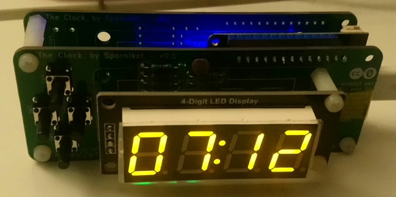
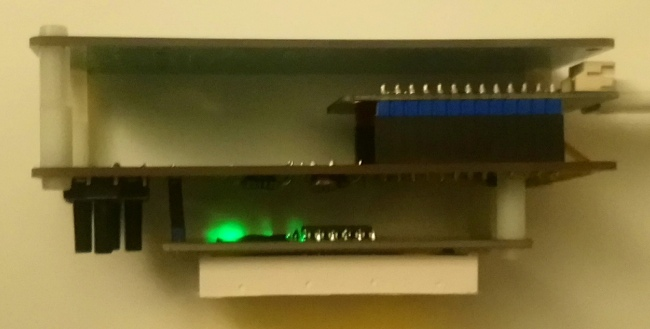

# Main board for The Clock supporting WEMOS Lolin32 lite

> [WARNING] Please read carefully this note before using this project. It contains important facts.

Content

1. What is **Main board for The Clock supporting WEMOS Lolin32 lite**, and when to use it ?
2. What should you know before using **Main board for The Clock supporting WEMOS Lolin32 lite** ?
3. How to use **Main board for The Clock supporting WEMOS Lolin32 lite** ?
4. Known issues
5. Miscellanous

## 1. What is **Main board for The Clock supporting WEMOS Lolin32 lite**, and when to use it ?

**Main board for The Clock supporting WEMOS Lolin32 lite**, as the name imply, is the hardware implementation of a seven-segment digital clock, synchronized to the network time using SNTP ; this particular implementation targets an ESP32 based development board known as _WEMOS Lolin32 lite_, that as been programmed using the esp32 based firmware.

### Licence

**Main board for The Clock supporting WEMOS Lolin32 lite** is published under the Creative Commons CC0 license. You can find a copy of the licence there : https://creativecommons.org/publicdomain/zero/1.0/legalcode

You can copy, modify, distribute and perform the work, even for commercial purposes, all without asking permission.

**Main board for The Clock supporting WEMOS Lolin32 lite** is distributed in the hope that it will be useful, but WITHOUT ANY WARRANTY; without even the implied warranty of MERCHANTABILITY or FITNESS FOR A PARTICULAR PURPOSE.

### Release notes

#### Version 0.1.1

* Fixed : missing pull-up resistors for SDA/SCL

#### Version 0.1.0

Initial release, includes an ambient light sensor using an LDR.

## 2. What should you know before using **Main board for The Clock supporting WEMOS Lolin32 lite** ?

**Main board for The Clock supporting WEMOS Lolin32 lite** is made using Kicad 7.

> Do not use **Main board for The Clock supporting WEMOS Lolin32 lite** if this project is not suitable for your project.

## 3. How to use **Main board for The Clock supporting WEMOS Lolin32 lite** ?

### From sources

To get the latest available work, one must clone the git repository, build and install the package.

	git clone --recurse-submodules https://github.com/sporniket/the-clock--main-pcb-esp32--lolin32-lite.git

Then, open the project with Kicad 7.

## 4. Known issues
See the [project issues](https://github.com/sporniket/the-clock--main-pcb-esp32--lolin32-lite/issues) page.

## 5. Miscellanous

### Report issues
Use the [project issues](https://github.com/sporniket/the-clock--main-pcb-esp32--lolin32-lite/issues) page.
